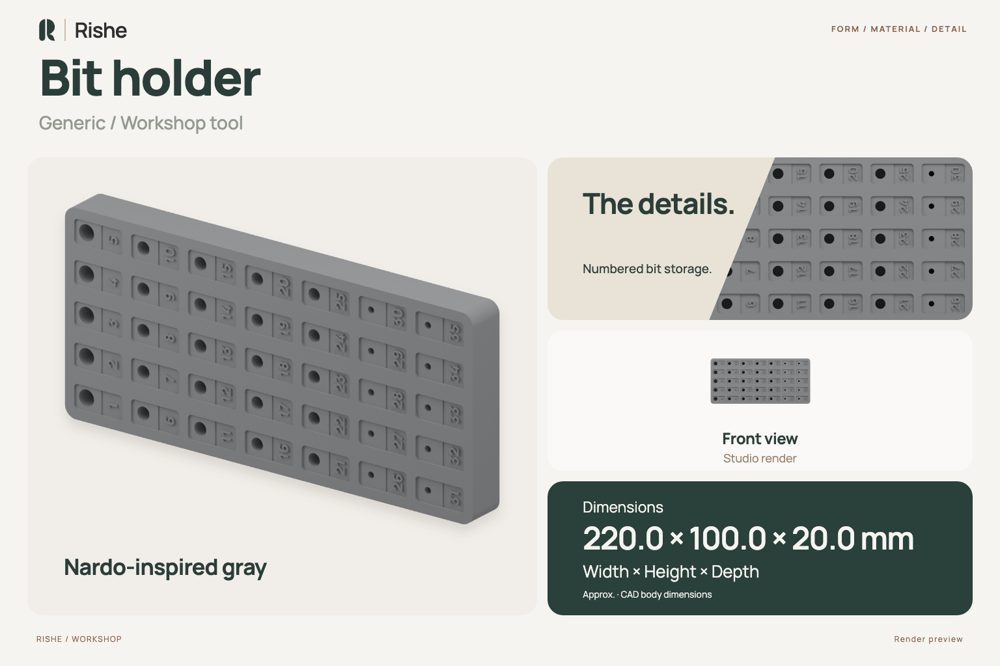
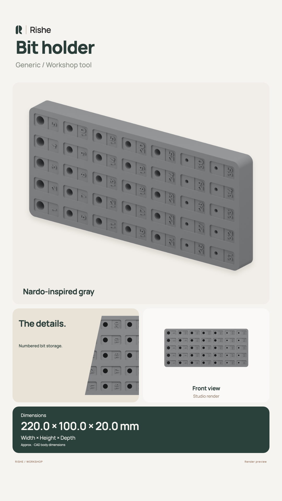
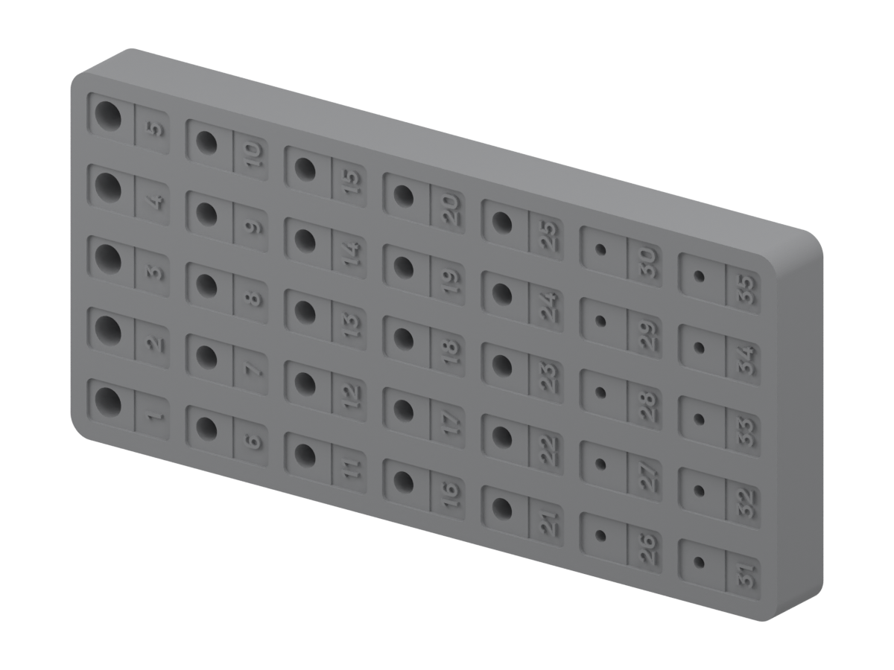
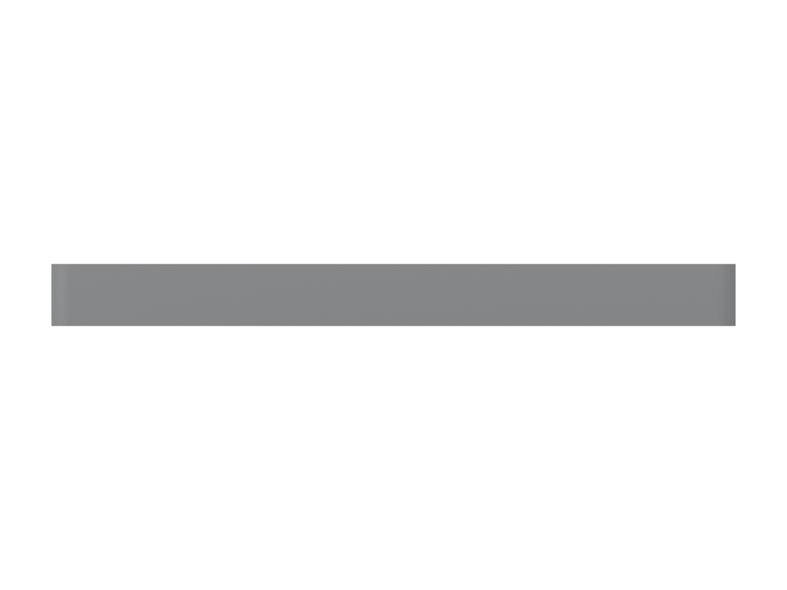

# Bit holder

This directory contains the FreeCAD source and published exports for a bit-holder design.

## Overview and renders

Instagram Story overview

| Three-quarter | Front | Side | Top | Back |
| --- | --- | --- | --- | --- |
|  |  |  |  |  |

The previews use the published STEP export. Gray is an illustrative finish.

## Files

| Path | Purpose |
| --- | --- |
| [`object.FCStd`](object.FCStd) | Editable FreeCAD source model. |
| [`object.20260814-151701.FCBak`](object.20260814-151701.FCBak) | FreeCAD backup retained with the source files. Treat it as a recovery copy, not the canonical source. |
| [`exports/var1-20mmd-with-numbers/`](exports/var1-20mmd-with-numbers/) | Published export package. |
| `object.step` | Solid CAD exchange export. |
| `object.stl` | Mesh export. |
| `object.obj` | Mesh export. |
| `object.mtl` | Material reference associated with the OBJ export. |

The export directory name is retained as published. Confirm the intended variant in FreeCAD or in your CAD/CAM software before manufacturing.

## Before use

- Confirm the model opens correctly and is at the expected scale and unit system.
- Measure or inspect the dimensions that matter for your intended bits, tooling, and workspace.
- Check fit, clearance, orientation, and accessibility in the actual setup.
- Select a material and manufacturing process appropriate to the loads and environment.
- Perform a test fit or test piece before relying on the finished part.

The overview dimensions are measured CAD bounding extents. Tolerances, material specification, and machine compatibility remain unverified. Treat those values as user-verification items until a measured design specification is added.

## Choosing a file

Use the `.FCStd` file when you need to inspect the design or work with its FreeCAD structure. Use the STEP file for solid CAD/CAM workflows and the STL or OBJ files for mesh-based workflows. The OBJ and MTL files should be kept together when importing the OBJ into software that uses material references.

## Revision notes

The source and exports currently have no formal release or revision metadata. When updating this design, record the change and regenerate the affected exports together with the source, following [`CONTRIBUTING.md`](../../CONTRIBUTING.md).
