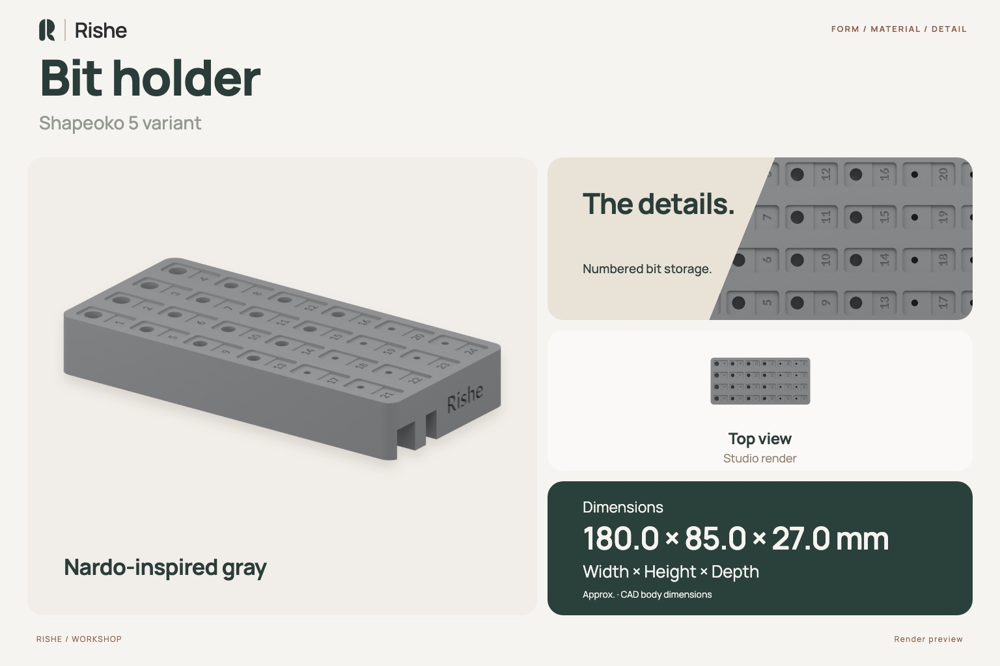
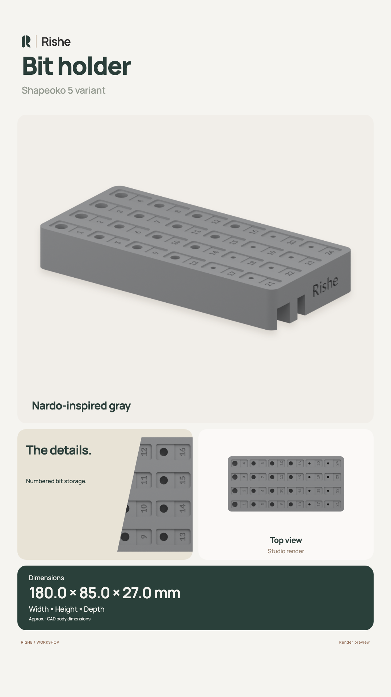
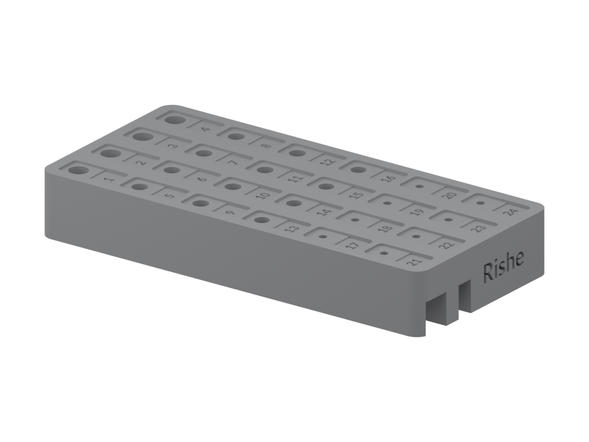
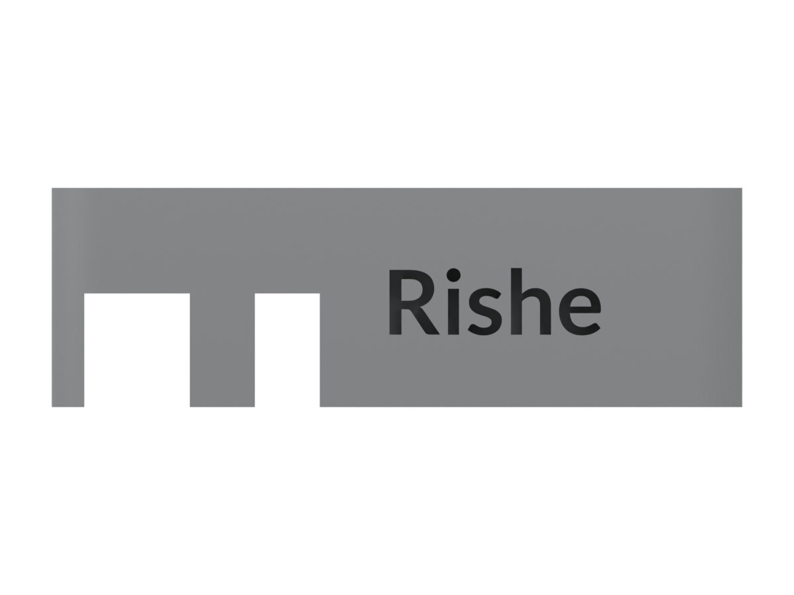
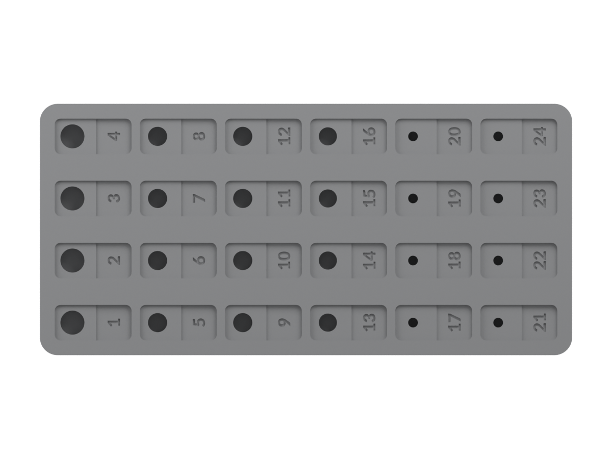

# Shapeoko 5 bit holder

A separately maintained bit-holder variant for a Shapeoko 5 setup. Verify fit against your machine.

## Overview and renders

Instagram Story overview

| Three-quarter | Front | Side | Top | Back |
| --- | --- | --- | --- | --- |
|  |  |  |  |  |

The previews and CAD dimensions use the published STEP export; the editable source may contain newer changes. Gray is an illustrative finish.

## Files

- [FreeCAD source](object.FCStd)
- [Published STEP, STL, OBJ and MTL exports](exports/var1-180mml-with-numbers/)

## Before use

Check scale, critical dimensions, clearance and mounting fit in your setup. Select a suitable material and process, and perform a test fit. CAD extents are not a verified fit specification.

See the [contribution guide](../../CONTRIBUTING.md) and [visual asset guide](../../docs/visual-assets.md) when updating the design or previews.
