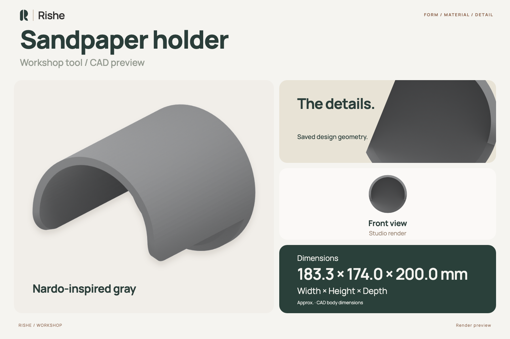
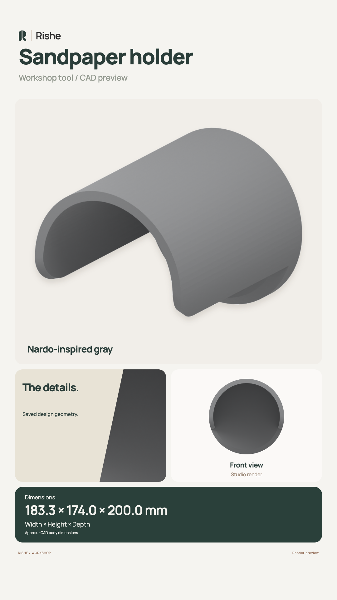
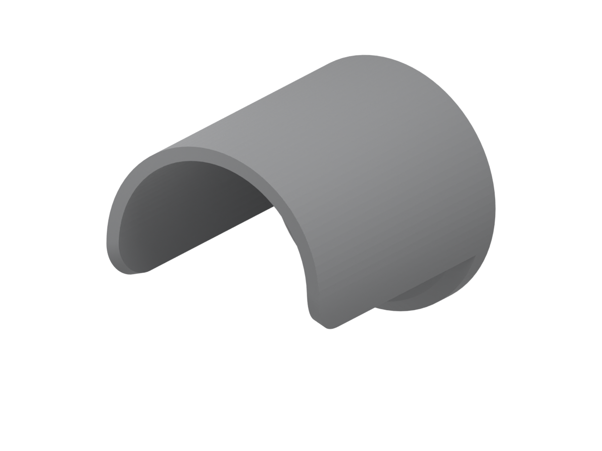
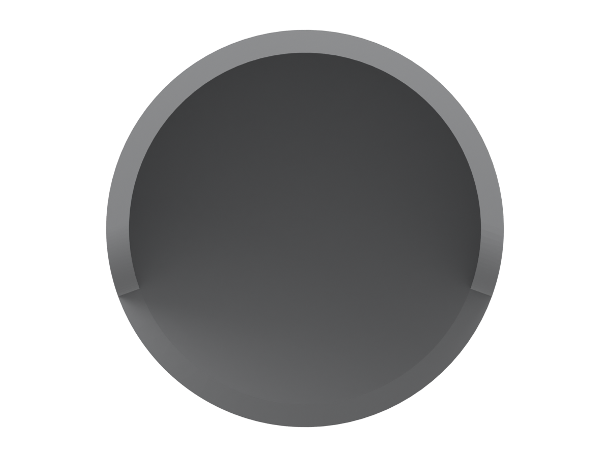
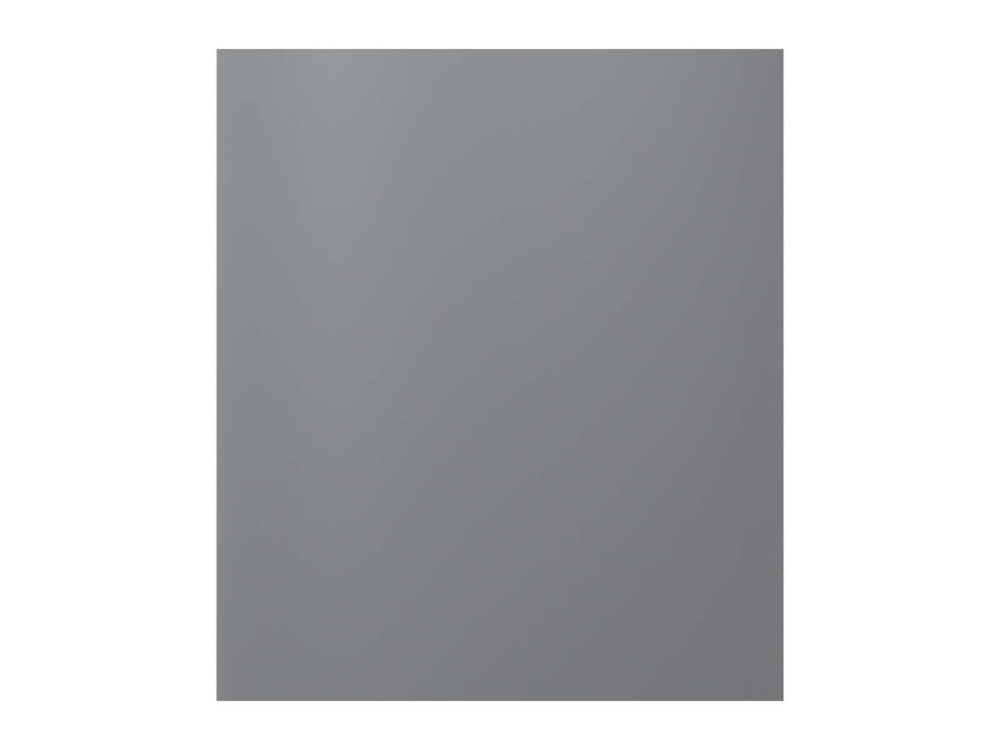

# Sandpaper holder

Saved FreeCAD design for a sandpaper holder. This design currently has no published interchange exports.

## Overview and renders

Instagram Story overview

| Three-quarter | Front | Side | Top | Back |
| --- | --- | --- | --- | --- |
|  |  |  |  |  |

These previews and CAD dimensions come from the saved solid bodies in [object.FCStd](object.FCStd). Gray is an illustrative finish. Generated images live under `main/object/`.

## Before use

Inspect the source geometry, scale, sandpaper fit and attachment before fabrication. Material, process and fit have not been specified.

See the [contribution guide](../../CONTRIBUTING.md) and [visual asset guide](../../docs/visual-assets.md) when updating the design or previews.
